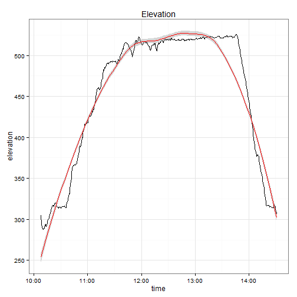
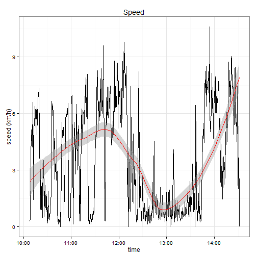
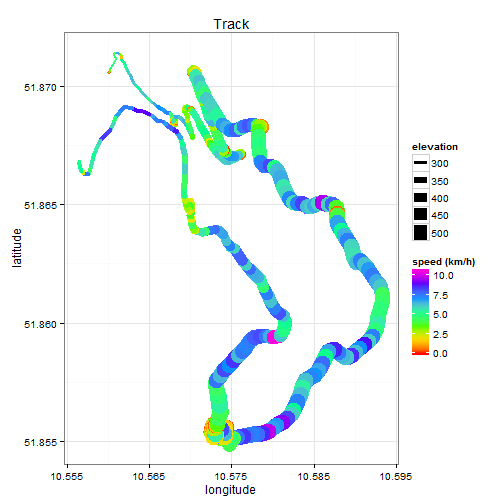
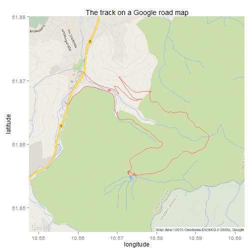
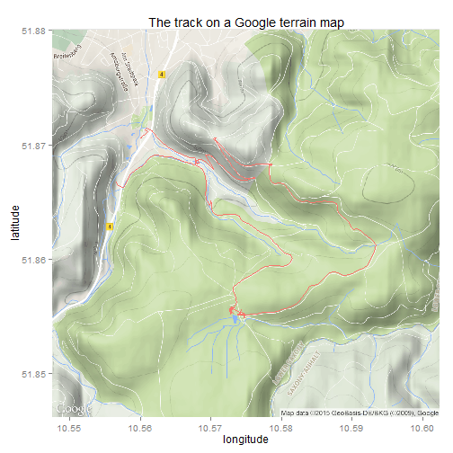
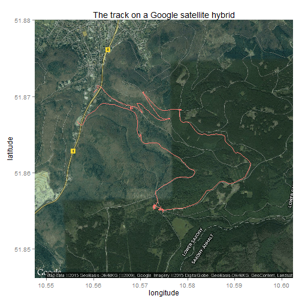
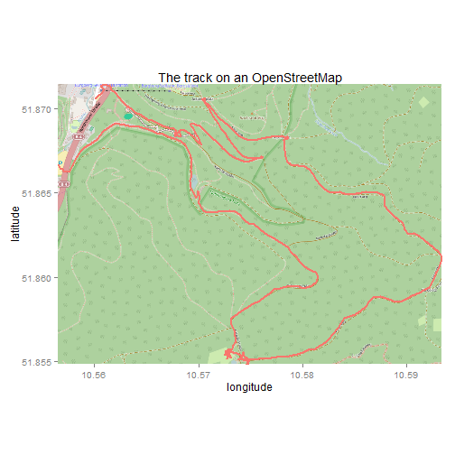

This year, my group's works outing happened around [Bad Harzburg](http://www.bad-harzburg.de/): We spent the first half in groups searching for [geocaches](http://www.bad-harzburg.de/wanderland/wandererlebnisse/geocaching-touren.html) and the second half playing something called ["Swingolf"](http://krodoland.de/golf/swingolf) and having a barbecue. For the first part I brought our private Garmin along, in case we needed some more GPS devices - which means that now I can look at and analyse the route my group took. Cool! Even better, this can be done in R! I found [this nice tutorial at R-bloggers](http://www.r-bloggers.com/stay-on-track-plotting-gps-tracks-with-r/) and decided to try it out with my data - though I switched from the standard plotting functions to `ggplot2` and `ggmap`.


At first, I had to install all the libraries and ran into some trouble with `rJava`, which is needed for `OpenStreetMap`. Apparently, I had only 32-bit Java installed on my 64-bit Surface with 64-bit R, so I had to install the 64-bit Java version as well. Then everything was running smoothly.


```r
library(XML)
library(OpenStreetMap)
library(lubridate)
library(ggplot2)
library(ggmap)
```

Reading in the GPX file is a breeze with the `XML` package (although everything is a breeze when you find such a perfectly working script online): simply give it the path and name of the GPX file, set `useInternalNodes` to `TRUE` to speed things up and the file is there to extract data from. This is done using `xpathSApply`, which finds matching nodes in an internal XML tree - meaning the tree created from the GPX file in the previous step. I have to admit that I wouldn't have known what the nodes are called, but you can have a look at the parsed tree and guess from there.  
For better handling, everything is combined in one data frame after extraction. You can see the first six rows of that below.


```r
# Parse the GPX file
pfile <- htmlTreeParse("Betriebsausflug.gpx", useInternalNodes = TRUE)
# pfile

# Get all elevations, times and coordinates via the respective xpath
elevations <- as.numeric(xpathSApply(pfile, path = "//trkpt/ele", xmlValue))
times <- xpathSApply(pfile, path = "//trkpt/time", xmlValue)
coords <- xpathSApply(pfile, path = "//trkpt", xmlAttrs)

# Extract latitude and longitude from the coordinates
lats <- as.numeric(coords["lat", ])
lons <- as.numeric(coords["lon", ])

# Put everything in a dataframe and get rid of old variables
geodf <- data.frame(lat = lats, lon = lons, ele = elevations, time = times)
rm(list = c("elevations", "lats", "lons", "pfile", "times", "coords"))
head(geodf)
```

```
##        lat      lon    ele                 time
## 1 51.87057 10.56008 304.88 2015-09-15T08:07:36Z
## 2 51.87059 10.56006 294.30 2015-09-15T08:08:06Z
## 3 51.87058 10.56008 290.94 2015-09-15T08:08:36Z
## 4 51.87059 10.56011 289.97 2015-09-15T08:09:06Z
## 5 51.87075 10.56031 289.01 2015-09-15T08:09:36Z
## 6 51.87092 10.56066 287.57 2015-09-15T08:10:06Z
```

In order to be able to calculate the distance from one observed point to another, we have to add the latitude and longitude values to their previous rows, so that in each row we'll know what comes next. The below function can do that.


```r
shift.vec <- function(vec, shift) {
    if (length(vec) <= abs(shift)) {
        rep(NA, length(vec))
    } else {
        if (shift >= 0) {
            c(rep(NA, shift), vec[1:(length(vec) - shift)])
        } else {
            c(vec[(abs(shift) + 1):length(vec)], rep(NA, abs(shift)))
        }
    }
}
```

With the help of the `shift.vec` function, we can now add the relevant "future" data to each row in the data frame, and calculate distances and time differences between observations.


```r
# Shift vectors for lat and lon so that each row also contains the next
# position.
geodf$lat.p1 <- shift.vec(geodf$lat, -1)
geodf$lon.p1 <- shift.vec(geodf$lon, -1)

# Calculate distances (in metres) using the function pointDistance from the
# 'raster' package.  Parameter 'lonlat' has to be TRUE!
geodf$dist.to.prev <- apply(geodf, 1, FUN = function(row) {
    pointDistance(c(as.numeric(row["lat.p1"]), as.numeric(row["lon.p1"])), c(as.numeric(row["lat"]), 
        as.numeric(row["lon"])), lonlat = T)
})
```

There is one problem with the time data, though. Apparently our Garmin was around two hours behind the actual time, so I'm going to add two hours to every time point, after I have converted the data into a time format R understands. Then I can use `shift.vec` again, calculate the time differences between all neighbouring points, and use this to calculate our speed as well.


```r
# Transform the column 'time' so that R knows how to interpret it.
geodf$time <- strptime(geodf$time, format = "%Y-%m-%dT%H:%M:%OS")

# Add two hours to each time point
geodf$time$hour <- geodf$time$hour + 2

# Shift the time vector, too.
geodf$time.p1 <- shift.vec(geodf$time, -1)

# Calculate the number of seconds between two positions.
geodf$time.diff.to.prev <- as.numeric(difftime(geodf$time.p1, geodf$time))

# Calculate metres per seconds and kilometres per hour
geodf$speed.m.per.sec <- geodf$dist.to.prev/geodf$time.diff.to.prev
geodf$speed.km.per.h <- geodf$speed.m.per.sec * 3.6
geodf$speed.km.per.h <- ifelse(is.na(geodf$speed.km.per.h), 0, geodf$speed.km.per.h)
```

Finally, it is time to plot the data!


```r
# Plot elevation with loess smoother
ggplot(geodf, aes(x = time, y = ele)) + geom_line() + geom_smooth(color = "red") + 
    theme_bw() + labs(y = "elevation", title = "Elevation")
```

 

```r
# Plot speed with loess smoother
ggplot(geodf, aes(x = time, y = speed.km.per.h)) + geom_line() + geom_smooth(color = "red") + 
    theme_bw() + labs(y = "speed (km/h)", title = "Speed")
```

 

```r
# Plot the track without any map, the shape of the track is already visible.
ggplot(geodf, aes(x = lon, y = lat)) + geom_path(aes(colour = speed.km.per.h, 
    size = ele), lineend = "round") + theme_bw() + labs(x = "longitude", y = "latitude", 
    title = "Track") + scale_color_gradientn(colours = rainbow(7), name = "speed (km/h)") + 
    scale_size(name = "elevation")
```

 

In the third plot I added colour and line thickness to the actual track. The colour corresponds to our walking speed, while the line thickness corresponds to the elevation. Since our lunch break (which you can easily see on the "Speed" plot) was on one of the highest points of the track, it is a bit more difficult to distinguish, due to the overlay of observations with movement. It is also the point with the lowest latitude, though, so you can have an easy guess.  
Three points along the track signify the caches we had to find (and we found them all), while others are either points of map consultation or - in one case - of a huge toadstool which had to be photographed.

You might wonder, now, whether we actually took the shortest route, or where exactly we were, anyway. [Let's add a map](https://www.nceas.ucsb.edu/~frazier/RSpatialGuides/ggmap/ggmapCheatsheet.pdf)!


```r
# standard road map by Google
googlemap_road <- get_map(location = c(min(geodf$lon), min(geodf$lat), max(geodf$lon), 
    max(geodf$lat)), maptype = "roadmap", source = "google", zoom = 14)

ggmap(googlemap_road) + geom_path(data = geodf, aes(x = lon, y = lat, colour = "red"), 
    lineend = "round") + labs(x = "longitude", y = "latitude", title = "The track on a Google road map") + 
    theme(legend.position = "none")
```

 

```r
# terrain map by Google
googlemap_terrain <- get_map(location = c(min(geodf$lon), min(geodf$lat), max(geodf$lon), 
    max(geodf$lat)), maptype = "terrain", source = "google", zoom = 14)

ggmap(googlemap_terrain) + geom_path(data = geodf, aes(x = lon, y = lat, colour = "red"), 
    lineend = "round") + labs(x = "longitude", y = "latitude", title = "The track on a Google terrain map") + 
    theme(legend.position = "none")
```

 

```r
# hybrid map by Google
googlemap_hybrid <- get_map(location = c(min(geodf$lon), min(geodf$lat), max(geodf$lon), 
    max(geodf$lat)), maptype = "hybrid", source = "google", zoom = 14)

ggmap(googlemap_hybrid) + geom_path(data = geodf, aes(x = lon, y = lat, colour = "red"), 
    lineend = "round") + labs(x = "longitude", y = "latitude", title = "The track on a Google satellite hybrid") + 
    theme(legend.position = "none")
```

 

Together with the coordinates and hints for the geocaches, we also got a map, which must have been from Google as well, as it looks like the first of the three maps plotted here. It seems we took exactly the path we meant to take according to the map. There would have been a shortcut, though, which was visible on my Garmin device running with [OpenStreetMap](https://www.openstreetmap.org/).


```r
# OpenStreetMap
osmap <- get_map(location = c(min(geodf$lon), min(geodf$lat), max(geodf$lon), 
    max(geodf$lat)), source = "osm")

ggmap(osmap) + geom_path(data = geodf, aes(x = lon, y = lat, colour = "red"), 
    lineend = "round", size = 1) + labs(x = "longitude", y = "latitude", title = "The track on an OpenStreetMap") + 
    theme(legend.position = "none")
```

 

There it is! The path we didn't take, because it wasn't on the printed map, it was steep, and we couldn't agree if it would be the right direction in any case. We saw it later on, though, after the zig (or was it the zag?).

That was our geocache searching hike. It was fun - almost as much fun as playing around with the data in R. ;-)
